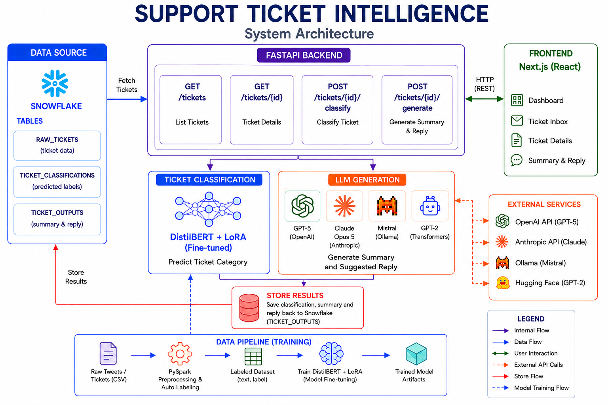

# Support Ticket Intelligence

An AI-powered customer support system that automatically classifies, summarizes, and routes customer support tickets to reduce manual work and response time.

## Features

- Automatic ticket classification using DistilBERT + LoRA fine-tuning
- AI-generated ticket summaries
- Context-aware customer reply generation
- Multiple LLM support
  - GPT-5
  - Claude
  - Mistral
  - GPT-2
- Snowflake integration for ticket storage and retrieval
- FastAPI REST API backend
- Next.js frontend
- PySpark-based preprocessing pipeline for training data


## Architecture

<p align="center">
  
</p>


## Tech Stack

### Frontend
- Next.js
- React
- TypeScript

### Backend
- FastAPI
- Uvicorn

### Machine Learning
- DistilBERT
- LoRA (PEFT)
- Hugging Face Transformers
- PyTorch

### Large Language Models
- GPT-5 (OpenAI)
- Claude (Anthropic)
- Mistral (Ollama)
- GPT-2 (Transformers)

### Data Processing
- PySpark
- Pandas
- NumPy

### Database
- Snowflake

---

## Project Structure

```text
support-ticket-intelligence/
│
├── backend/
│   ├── main.py
│   ├── bert_lora_result.py
│   ├── train_bert_lora.py
│   ├── llm_gpt5.py
│   ├── llm_claude.py
│   ├── llm_mistral.py
│   ├── llm_gpt2.py
│   └── auto_label_spark.py
│
├── frontend/
│
├── snowflake/
│   └── ddl.sql
│
├── src/
├── requirements.txt
└── README.md
```

---

## Running Locally

### Clone the repository

```bash
git clone https://github.com/nethra4321/support-ticket-intelligence.git

cd support-ticket-intelligence
```

### Create a virtual environment

```bash
python -m venv .venv
```

### Activate the virtual environment

**Windows**

```bash
.venv\Scripts\activate
```

**Linux / macOS**

```bash
source .venv/bin/activate
```

### Install dependencies

```bash
pip install -r requirements.txt
```

---

## Environment Variables

Create a `.env` file in the project root.

```env
# Snowflake Configuration
SNOWFLAKE_ACCOUNT=
SNOWFLAKE_USER=
SNOWFLAKE_PASSWORD=
SNOWFLAKE_ROLE=
SNOWFLAKE_WAREHOUSE=
SNOWFLAKE_DATABASE=STI
SNOWFLAKE_SCHEMA=PUBLIC

# OpenAI
OPENAI_API_KEY=
OPENAI_MODEL=gpt-5

# Anthropic
ANTHROPIC_API_KEY=
ANTHROPIC_MODEL=claude-sonnet-5

# Ollama
OLLAMA_URL=http://localhost:11434
```

---

## Running the Backend

```bash
uvicorn backend.main:app --reload --port 8000
```

Backend:

```text
http://localhost:8000
```

---

## Running the Frontend

```bash
cd frontend

npm install

npm run dev
```

Frontend:

```text
http://localhost:3000
```


## API Endpoints

| Method | Endpoint | Description |
|---------|----------|-------------|
| GET | `/tickets` | Retrieve all support tickets |
| GET | `/tickets/{id}` | Retrieve ticket details |
| POST | `/tickets/{id}/classify` | Classify a support ticket |
| POST | `/tickets/{id}/generate` | Generate ticket summary and suggested reply |


## Workflow

1. Retrieve support tickets from Snowflake.
2. Classify each ticket using the fine-tuned DistilBERT + LoRA model.
3. Select an LLM (GPT-5, Claude, Mistral, or GPT-2).
4. Generate a concise ticket summary.
5. Generate a contextual customer support reply.
6. Store AI-generated outputs in Snowflake.
7. Display ticket details, classification, summary, and suggested reply through the Next.js interface.


## Evaluation

Dataset : https://www.kaggle.com/datasets/thoughtvector/customer-support-on-twitter

The ticket classification model was fine-tuned using LoRA on a DistilBERT backbone with a training dataset of 80,000 support tickets of different companies on twitter across 17 ticket categories. The model achieved 96.38% validation accuracy on a held-out validation dataset.


## Requirements

- Python 3.9+
- Node.js 18+
- Snowflake account
- OpenAI API key (GPT-5)
- Anthropic API key (Claude)
- Ollama (for local Mistral inference)


